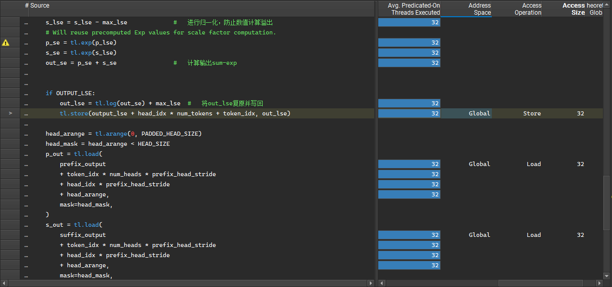
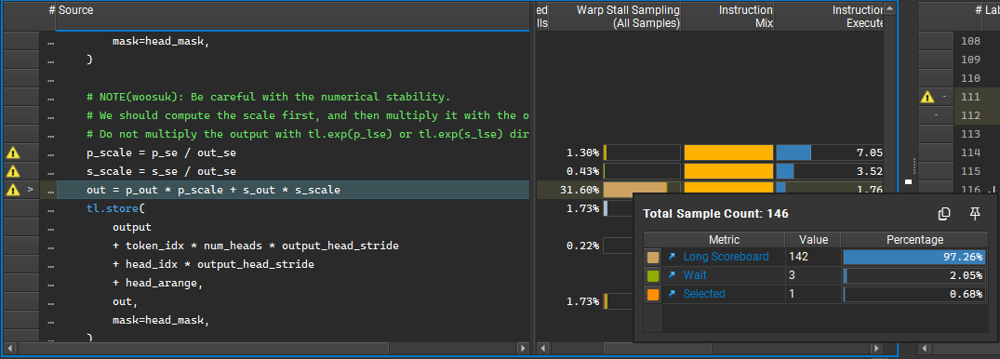
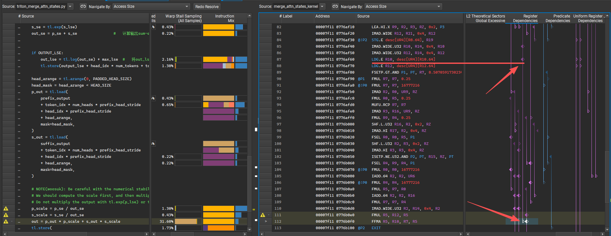
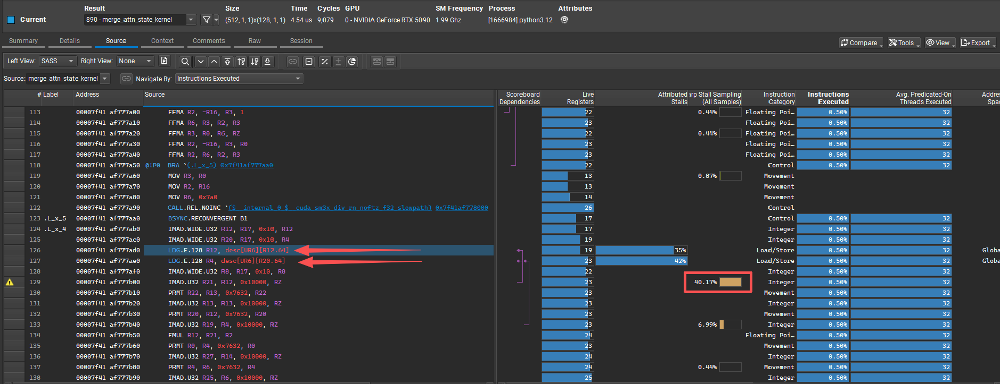
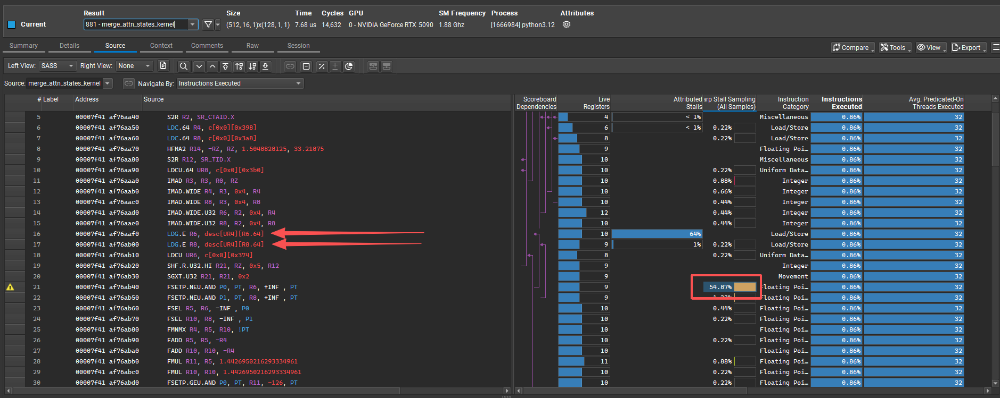
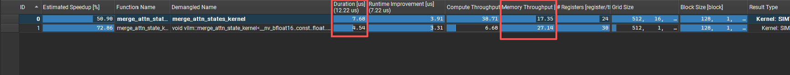
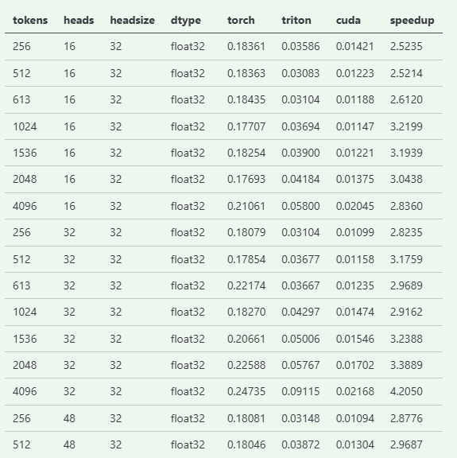

# optimize_merge_attn_state_in_vllm
## Merge Attention States简介
[FlashInfer: Efficient and Customizable Attention Engine for LLM Inference Serving](https://arxiv.org/html/2501.01005?_immersive_translate_auto_translate=1)

我们知道，对于《Attention is all you need》里面的 Attention 计算公式为：

$$O = softmax(\frac{QK^T}{\sqrt{d_k}})V$$

假设缩放因子 $\sqrt{d_k}$ 已经被吸收到 $\mathbf{q}$ 或 $\mathbf{k}$ 中，那么对于单个查询向量 $\mathbf{q}$，它与序列中所有 $N$ 个键 $\mathbf{k}_i$ 和值 $\mathbf{v}_i$ 作用后的全局注意力输出 $\mathbf{o}$ 应当为：

$$\mathbf{o} = \sum_{i=1}^N \frac{\exp(\mathbf{q} \cdot \mathbf{k}_i)}{\sum_{j=1}^N \exp(\mathbf{q} \cdot \mathbf{k}_j)} \mathbf{v}_i$$

对于分母的全局归一化项，在标准的 Transformer 中，必须遍历完所有 $N$ 个 Token 才能计算出这个分母，这严重阻碍了完全并行的分块计算。为了实现块并行（Block-Parallel），我们假设把长度为 $N$ 的序列切分为若干个块。以 $\mathcal{J}$ 表示其中某一个块的索引集合（例如，第 1 到 64 个 Token）。在计算该块的局部注意力时，其局部归一化项为：

$$\text{局部归一化项} = \sum_{j \in \mathcal{J}} \exp(\mathbf{q} \cdot \mathbf{k}_j)$$

直接保存局部归一化项在数值上极易导致指数溢出。因此，我们引入 Log-Sum-Exp (LSE) 技巧来保证数值稳定性。我们将块 $\mathcal{J}$ 的注意力尺度（Attention scalar）定义为局部归一化项的对数：

$$\mathbf{LSE}(\mathcal{J}) = \log \sum_{i \in \mathcal{J}} \exp(\mathbf{q} \cdot \mathbf{k}_i)$$

基于此，查询向量 $\mathbf{q}$ 在块 $\mathcal{J}$ 上的局部注意力输出 $\mathbf{O}(\mathcal{J})$ 就可以表示为：

$$\mathbf{O}(\mathcal{J}) = \sum_{i \in \mathcal{J}} \frac{\exp(\mathbf{q} \cdot \mathbf{k}_i)}{\exp(\mathbf{LSE}(\mathcal{J}))} \cdot \mathbf{v}_i$$

同理，对于查询 $\mathbf{q}$ 在另一个块 $\mathcal{T}$ 的局部注意力输出 $\mathbf{O}(\mathcal{T})$ 为

$$\mathbf{O}(\mathcal{T}) = \sum_{j \in \mathcal{T}} \frac{\exp(\mathbf{q} \cdot \mathbf{k}_j)}{\exp(\mathbf{LSE}(\mathcal{T}))} \cdot \mathbf{v}_i$$

论文里将注意力状态定义注意力输出和注意力尺度的元组：
$
\begin{bmatrix}
O(\mathcal{J}) \\
\text{LSE}(\mathcal{J})
\end{bmatrix}
$
那么对于 $\mathcal{T} \cup \mathcal{J}$ 的注意力状态就可以通过引入算子 $\oplus$ 进行计算：

$$
\begin{aligned}
\begin{bmatrix} 
\mathbf{O}(\mathcal{J} \cup \mathcal{T}) \\
\text{LSE}(\mathcal{J} \cup \mathcal{T}) 
\end{bmatrix} 
&= 
\begin{bmatrix} 
\mathbf{O}(\mathcal{J}) \\
\text{LSE}(\mathcal{J}) 
\end{bmatrix} 
\oplus 
\begin{bmatrix}
\mathbf{O}(\mathcal{T}) \\
\text{LSE}(\mathcal{T}) 
\end{bmatrix} \\
&= \begin{bmatrix} 
\displaystyle\frac{\exp(\text{LSE}(\mathcal{J}))\mathbf{O}(\mathcal{J}) + \exp(\text{LSE}(\mathcal{T}))\mathbf{O}(\mathcal{T})}{\exp(\text{LSE}(\mathcal{J})) + \exp(\text{LSE}(\mathcal{T}))} \\
\log(\exp(\text{LSE}(\mathcal{J})) + \exp(\text{LSE}(\mathcal{T})))
\end{bmatrix}
\end{aligned}
$$

## pytorch实现

首先我们可以看一下`triton`实现过程中，所需要输入的数据
```python
def merge_attn_states(
    output: torch.Tensor,                   
    prefix_output: torch.Tensor,            
    prefix_lse: torch.Tensor,               
    suffix_output: torch.Tensor,            
    suffix_lse: torch.Tensor,               
    output_lse: torch.Tensor | None = None, 
)
```

`output`为`prefix_output`和`suffix_output`进行`merge`后输出的矩阵，维度为`[NUM_TOKENS, NUM_HEADS, HEAD_SIZE]` \
`prefix_output`与`suffix_output`为`切分token`中的`prefix`和`suffix`计算结果，维度为`[NUM_TOKENS, NUM_HEADS, HEAD_SIZE]`    \
`prefix_lse`与`suffix_lse`为`prefix`和`suffix`中的对数局部归一化值，由于我们在`MHA`中是对不同的头并行`attention`计算，所以该维度为`[NUM_HEADS, NUM_TOKENS]` \
`output_lse`为`prefix_lse`与`suffix_lse`最终合并后的结果，维度同上。

那么根据上述的思路可以有以下的pytorch实现：

```python
def merge_attn_states(
    output: torch.Tensor,                  
    prefix_output: torch.Tensor,           
    prefix_lse: torch.Tensor,              
    suffix_output: torch.Tensor,           
    suffix_lse: torch.Tensor,              
    output_lse: torch.Tensor | None = None,
):
    p_lse = prefix_lse  # [num_head,num_token]
    s_lse = suffix_lse  # [num_head,num_token]

    p_lse[p_lse == torch.inf] = -torch.inf
    s_lse[s_lse == torch.inf] = -torch.inf

    max_lse = torch.maximum(p_lse,s_lse)    #   [num_head,num_token]
    p_lse = p_lse - max_lse
    s_lse = s_lse - max_lse

    p_exp_lse = torch.exp(p_lse)    #   [num_head,num_token]
    s_exp_lse = torch.exp(s_lse)    #   [num_head,num_token]

    out_se = p_exp_lse + s_exp_lse  #   [num_head,num_token]
    if output_lse is not None:
        output_lse = torch.log(out_se) + max_lse

    p_scale = p_exp_lse/out_se      #   [num_head,num_token]   
    s_scale = s_exp_lse/out_se      #   [num_head,num_token]

    p_scale = torch.transpose(p_scale,0,1).unsqueeze(2) #   [num_token,num_head,1]
    s_scale = torch.transpose(s_scale,0,1).unsqueeze(2) #   [num_token,num_head,1]

    output = prefix_output*p_scale+suffix_output*s_scale

    return output,output_lse
```

这里中间为什么会有

```python
    p_lse[p_lse == torch.inf] = -torch.inf
    s_lse[s_lse == torch.inf] = -torch.inf
```

原因在`triton`源码中有一段话：“`Flash Attention2`和`Flash Attention3`中，面对`token length=0`的情况有不同的返回值，分别为`inf`和`-inf`。”

对于`merge attention state`来说，后续要进行指数运算，如果返回的是`-inf`，那么 $\exp(-\inf) = 0$ ，表示这个`token length = 0` 的切块对`attention`的贡献为0，这是正确的，但是如果是`inf`,则 $\exp(\inf) = \inf$ ，这就将导致数值溢出，计算结果错误，所以在这里加了一层过滤，对`Flash Attention2`的错误进行纠正

## triton基础算子
triton的实现主要包括以下的几个部分：
- 加载数据并inf处理
    ```python
    token_idx = tl.program_id(0)                                        #   当前线程计算token的索引
    num_tokens = tl.num_programs(0)                                     #   token的总数
    head_idx = tl.program_id(1)                                         #   当前线程计算head的索引
    num_heads = tl.num_programs(1)                                      #   当前head的总数

    p_lse = tl.load(prefix_lse + head_idx * num_tokens + token_idx)     #   取出当前计算token的前缀lse
    s_lse = tl.load(suffix_lse + head_idx * num_tokens + token_idx)     #   取出当前计算token的后缀lse

    # FA2 and FA3 have different behavior for when the sum-exp is 0, this namely
    # arises with 0 len seqlens. FA3 returns -inf here while FA2 returns inf.
    # If we see an inf assume FA2 and convert inf to -inf for consistency
    # and correctness. Inf generally doesn't make sense in this context outside
    # of undefined-behavior/FA2-case, so I think this a safe assumption.
    p_lse = float("-inf") if p_lse == float("inf") else p_lse           #   纠错fa2并防止数值溢出
    s_lse = float("-inf") if s_lse == float("inf") else s_lse           #   纠错fa2并防止数值溢出
    ```

- 数据归一化计算
    ```python
    max_lse = tl.maximum(p_lse, s_lse)  #   取最大lse
    p_lse = p_lse - max_lse             #   进行归一化，防止数值计算溢出
    s_lse = s_lse - max_lse             #   进行归一化，防止数值计算溢出
    # Will reuse precomputed Exp values for scalar factor computation.
    p_se = tl.exp(p_lse)                #   
    s_se = tl.exp(s_lse)                
    out_se = p_se + s_se                #   计算输出sum-exp
    ```

- 最后计算输出：计算`prefix_output`和`suffix_output`各自的`scalar`值，然后求两者的加权和作为最后的输出
    ```python
    head_arange = tl.arange(0, PADDED_HEAD_SIZE)
    head_mask = head_arange < HEAD_SIZE
    p_out = tl.load(
        prefix_output
        + token_idx * num_heads * prefix_head_stride
        + head_idx * prefix_head_stride
        + head_arange,
        mask=head_mask,
    )
    s_out = tl.load(
        suffix_output
        + token_idx * num_heads * prefix_head_stride
        + head_idx * prefix_head_stride
        + head_arange,
        mask=head_mask,
    )

    # NOTE(woosuk): Be careful with the numerical stability.
    # We should compute the scalar first, and then multiply it with the output.
    # Do not multiply the output with tl.exp(p_lse) or tl.exp(s_lse) directly.
    p_scale = p_se / out_se
    s_scale = s_se / out_se
    out = p_out * p_scale + s_out * s_scale
    tl.store(
        output
        + token_idx * num_heads * output_head_stride
        + head_idx * output_head_stride
        + head_arange,
        out,
        mask=head_mask,
    )
    ```


`vllm`给这个算子分配了`(num_tokens,num_query_heads)`个`threadblock`，每个`head`的`headsize`是多少，这个`threadblock`就处理多少个值

```python
# TODO(woosuk): Use CUDA kernel instead of Triton to minimize CPU overhead.
merge_attn_states_kernel[(num_tokens, num_query_heads)](
    output,
    output_lse,
    prefix_output,
    prefix_lse,
    suffix_output,
    suffix_lse,
    prefix_head_stride,
    output_head_stride,
    head_size,
    padded_head_size,
    output_lse is not None,
)
```

## Triton算子分析
- 基本分析 \
    基于上一小节，我们知道，`vllm`在调用`merge_attn_states_kernel`时，分配了`(num_tokens,num_query_heads)`个`threadblock`，每个`threadblock`处理`headsize`个数据，这就带来了一些问题：
    1. 如果`(num_tokens,num_query_heads)`较大，而`headsize`较小，就会导致`threadblock`数过大，而每个`threadblock`处理的数据量很小，计算密度低。
    2. 在调用`Triton kernel`的时候会带来一定的cpu开销

    那么我们可以通过`ncu`抓取`Triton`算子在执行`NUM_TOKENS = 512` `NUM_HEADS = 16` `HEAD_SIZES = 32`的执行情况

    如图所示，在所有数据类型都是`float`的推理过程中，`Triton`并没有生成高效的向量化访存指令，都是
    `ld.global.b32`，也就是每次都只访问32位的数据，

    

    并且因为这个原因，在最后执行计算`out`的时候吗，出现了`Warp stall`,查看其原因是因为`Long Scoreboard`，即`Warp`停下来等待从`Global Memory`或`Local Memory`读取的数据返回
    

    可以通过`register dependencies`查看是因为哪一段访存指令产生的`warp stall`,追溯到第87行指令，正好是`LDG.E`，即`load global memory`，即是因为从每个线程只从`global memory`中取一个`prefix_output`数据到寄存器中，但是这个长时间的取值过程会占用着寄存器，而其他`warp`因为寄存器处于占用状态，无法将数据从`global memory`中取到寄存器中，所以就处于`stall`的状态。
    

## CUDA算子优化
最终cuda算子实现如下：
```C++
namespace vllm {
    template <typename scalar_t , const uint NUM_THREADS>
    __global__ void merge_attn_state(
        scalar_t* output, const scalar_t* prefix_output, const float* prefix_lse, const scalar_t* suffix_output, const float* suffix_lse, scalar_t* output_lse, 
        const uint num_tokens, const uint num_heads, const uint head_size
    )
    {
        using pack_128b_t = uint4;
        const uint pack_size = 16/sizeof(scalar_t);
        const uint threads_per_head = head_size/pack_size;

        const uint globalId = blockIdx.x * NUM_THREADS + threadIdx.x;
        const uint tokens_heads_threads = num_tokens * num_heads * threads_per_head;

        if(globalId>tokens_heads_threads) return;

        const uint token_head_idx = globalId / threads_per_head;
        const uint pack_idx = globalId % threads_per_head;

        const uint token_idx = token_head_idx / num_heads;
        const uint head_idx = token_head_idx % num_heads;

        const uint pack_offest = pack_idx * pack_size;
        const uint head_offest = token_idx * num_heads * head_size + head_idx * head_size;
        const float* prefix_head_ptr = prefix_output + head_offest;
        const float* suffix_head_ptr = suffix_output + head_offest;
        scalar_t * output_head_ptr = output + head_offest;

        float p_lse = prefix_lse[head_idx*num_tokens + token_idx];
        float s_lse = suffix_lse[head_idx*num_tokens + token_idx];
        p_lse = std::isinf(p_lse) ? -std::numeric_limits<float>::infinity() : p_lse;
        s_lse = std::isinf(s_lse) ? -std::numeric_limits<float>::infinity() : s_lse;

        float max_lse = fmax(p_lse,s_lse);
        p_lse = p_lse-max_lse;
        s_lse = s_lse-max_lse;
        const float p_se = expf(p_lse);
        const float s_se = expf(s_lse);
        const float out_se = p_se + s_se;
        const float p_scale = p_se/out_se;
        const float s_scale = s_se/out_se;

        if(pack_offest<head_size)
        {
            pack_128b_t p_out_pack = reinterpret_cast<const pack_128b_t*>(prefix_head_ptr)[pack_idx];
            pack_128b_t s_out_pack = reinterpret_cast<const pack_128b_t*>(suffix_head_ptr)[pack_idx];
            pack_128b_t o_output_pack;

            #pragma unroll
            for(int i = 0;i<pack_size;++i)
            {
                float p_out_f = vllm::to_float(reinterpret_cast<const scalar_t*>(&p_out_pack)[i]);
                float s_out_f = vllm::to_float(reinterpret_cast<const scalar_t*>(&s_out_pack)[i]);
                float o_out_f = p_out_f * p_scale + s_out_f * s_scale;
                vllm::from_float(reinterpret_cast<const scalar_t*>(&o_output_pack)[i],o_out_f);
            }

            reinterpret_cast<pack_128b_t*>(output_head_ptr)[pack_idx] = o_output_pack;
        }

        if(output_lse != nullptr && pack_idx ==0)
        {
            float out_lse = log(out_se) + max_lse;
            output_lse[head_idx*num_tokens + token_idx] = out_lse;
        }
    }
}

```

这里采用`NUM THREADS = 128`作为默认线程数，根据上述分析，若采用`(num_tokens, num_heads, head_size)`布局，根据上述的讨论，在`head_size`较小时，无法有效地向量化访存，因此这里将`(num_tokens,num_heads,head_size)`扁平化处理：

```C++
const uint pack_size = 16/sizeof(scalar_t);
const uint threads_per_head = headsize/packsize;
const uint total_threads = num_tokens*num_heads*threads_per_head;

dim3 block(NUM_THREADS);
dim3 grid((total_threads+NUM_THREADS-1)/NUM_THREADS);
```

这里采用 `NUM_THREADS = 128` 作为默认 `Block` 大小。根据上述分析，每个线程被设计为负责一个 `128-bit` 的数据块 (pack)，其中包含 `pack_size` 个元素,其中`pack_size = 16 / sizeof(scalar_t)`。

考虑到在 `LLM` 推理中，`head_size` 可能有较小的情况（例如 64 或 128）。如果采用 `(num_tokens, num_heads)` 作为二维/三维 Grid 布局，会导致每个 `Block` 内的线程数`threads_per_head`远小于一个 `Warp` 32个线程，从而造成严重的硬件资源闲置与调度碎片化。例如：如果此时 `head_size` 为 `32` , 采用 `bf16` 进行计算，则此时一个`head` 所配备的 `block`的线程数为 `threads_per_head = 32/(16/2) = 4`

为此，该 Kernel 将 num_tokens、num_heads 和 threads_per_head 三个维度进行了一维线性化。并使用 `globalId` 反向计算当前处理的 `Head` 的全局索引 `token_head_idx` , 以及 `pack` 的索引 `pack_idx`。然后再根据 `Head` 的全局索引 `token_head_idx` 反向计算出 `token_idx` 和 `head_idx`。

```C++
const uint token_head_idx = globalId / threads_per_head;
const uint pack_idx = globalId % threads_per_head;

const uint token_idx = token_head_idx / num_heads;
const uint head_idx = token_head_idx % num_heads;
```

然后根据反算得到的`token_idx`, `head_idx`, `pack_idx`计算当前处理到哪个 `token` 中的哪个 `head` 即 `head_offest` ，而当前线程处理的 `pack` 则通过 `pack_offest`进行偏移

```C++
const uint pack_offest = pack_idx * pack_size;
const uint head_offest = token_idx * num_heads * head_size + head_idx * head_size;
const float* prefix_head_ptr = prefix_output + head_offest;
const float* suffix_head_ptr = suffix_output + head_offest;
scalar_t * output_head_ptr = output + head_offest;
```

然后便是取值计算,注意：这里lse维护的数据维度为 `(num_heads,num_tokens)` , 这里为什么不跟 `output` 一样采用 `(num_tokens, num_heads)`的分布呢，原因是：在上游计算 `Attention` 时，计算任务通常是按 `Head` 分配给不同的 `Thread Block` 的，那么布局为 `(num_heads,num_tokens)`时，`Thread Block`写回属于 `head 0` 的 `num_tokens` 时，内存时连续的，可以合并访存。

```C++
float p_lse = prefix_lse[head_idx*num_tokens + token_idx];
float s_lse = suffix_lse[head_idx*num_tokens + token_idx];
p_lse = std::isinf(p_lse) ? -std::numeric_limits<float>::infinity() : p_lse;
s_lse = std::isinf(s_lse) ? -std::numeric_limits<float>::infinity() : s_lse;

float max_lse = fmax(p_lse,s_lse);
p_lse = p_lse-max_lse;
s_lse = s_lse-max_lse;
const float p_se = expf(p_lse);
const float s_se = expf(s_lse);
const float out_se = p_se + s_se;
const float p_scale = p_se/out_se;
const float s_scale = s_se/out_se;
```

然后进行合并访存，并把数据写回out

```C++
if(pack_offest<head_size)
{
    pack_128b_t p_out_pack = reinterpret_cast<const pack_128b_t*>(prefix_head_ptr)[pack_idx];
    pack_128b_t s_out_pack = reinterpret_cast<const pack_128b_t*>(suffix_head_ptr)[pack_idx];
    pack_128b_t o_output_pack;

    #pragma unroll
    for(int i = 0;i<pack_size;++i)
    {
        float p_out_f = vllm::to_float(reinterpret_cast<const scalar_t*>(&p_out_pack)[i]);
        float s_out_f = vllm::to_float(reinterpret_cast<const scalar_t*>(&s_out_pack)[i]);
        float o_out_f = p_out_f * p_scale + s_out_f * p_scale;

        vllm::from_float(reinterpret_cast<const scalar_t*>(&o_output_pack)[i],o_out_f);
    }
    reinterpret_cast<pack_128b_t*>(output_head_ptr)[pack_idx] = o_output_pack;
}
```

## NCU Profile分析
最后可以使用 `ncu` 抓一下当 `num_tokens = 512` ,`num_heads = 16`, `head_size = 64` 时实际跑的 `SASS` 指令，可以发现：
确实都用上了向量化访存指令，每次取值都是 `128bit` ，虽然 `warp stall` 相较于 `triton kernel`有所下降，但是仍然有**91次**因`Long Scoreboard`而导致的 `warp stall`，后续可以采用 `double buffer` 等方法进行优化。



而 `triton kernel`通过 `ncu` 抓取出来的 `SASS` 如图所示：


对比一下`memory throughput`:17.35(Triton kernel)->27.14(CUDA kernel)，在使用`bfloat16`进行推理的情况下能够达到`~1.69x`的加速比


## diapatch 逻辑
这里的 `merge_attn_states` 是 `C++` 层面对接 `Python` 的入口函数。当 `Python` 端调用该算子时，`DISPATCH_BY_SCALAR_DTYPE` 宏会根据输入张量 `output` 的动态数据类型（dtype）进行路由分发。

它通过宏替换，将匹配到的 `C++` 静态数据类型（如 `float` 或 `uint16_`t）作为模板参数传递给 `CALL_MERGE_ATTN_STATES_LAUNC`HER 宏。最终，调用链路进入 `merge_attn_states_launcher` 启动器层，在这里提取出张量底层的显存指针（.data_ptr()），并配置好 `Grid` 和 `Block`，启动对应数据类型编译生成的 `CUDA` 核函数。

```C++
#define DISPATCH_BY_DTYPE(scalar_dtype,fn)                              \
{                                                                       \
    if(scalar_dtype == at::ScalarType::Float){                          \
        fn(float);                                                      \
    }else if(scalar_dtype == at::ScalarType::Half){                     \
        fn(uint16_t);                                                   \
    }else if(scalar_dtype == at::ScalarType::BFloat16){                 \
        fn(__nv_bfloat16);                                              \
    }else{                                                              \
        TORCH_CHECK(false,"Unsupported data type of O: ", scalar_dtype); \
    }                                                                   \
}

#define LAUNCH_MERGE_ATTN_STATES(scalar_t,NUM_THREADS)                  \
{                                                                       \
    vllm::merge_attn_state_kernel<scalar_t,NUM_THREADS><<<grid,block>>>(\
        reinterpret_cast<scalar_t*>(output.data_ptr()),                 \
        reinterpret_cast<scalar_t*>(prefix_output.data_ptr()),          \
        reinterpret_cast<float*>(prefix_lse.data_ptr()),             \
        reinterpret_cast<scalar_t*>(suffix_output.data_ptr()),          \
        reinterpret_cast<float*>(suffix_lse.data_ptr()),             \
        output_lse_ptr,num_tokens,num_heads,head_size                       \
    );                                                                  \
}


template<typename scalar_t>
void merge_attn_state_launcher(torch::Tensor& output,
                                torch::Tensor& prefix_output,
                                torch::Tensor& prefix_lse,
                                torch::Tensor& suffix_output,
                                torch::Tensor& suffix_lse,
                                std::optional<torch::Tensor> output_lse)
{
    constexpr uint NUM_THREADS = 128;
    const uint num_tokens = output.size(0);
    const uint num_heads = output.size(1);
    const uint head_size = output.size(2);
    const uint pack_size = 16/sizeof(scalar_t);
    TORCH_CHECK(head_size%pack_size==0,"headsize must be multiple of pack_size:",pack_size);
    float* output_lse_ptr = nullptr;
    if(output_lse.has_value())
    {
        output_lse_ptr = output_lse.value().data_ptr<float>();
    }
    const uint threads_per_head = head_size/pack_size;
    const uint total_threads = num_tokens*num_heads*threads_per_head;

    dim3 block(NUM_THREADS);
    dim3 grid((total_threads+NUM_THREADS-1)/NUM_THREADS);

    LAUNCH_MERGE_ATTN_STATES(scalar_t, NUM_THREADS);
}

#define CALL_MERGE_ATTN_STATES_LAUNCHER(scalar_t)                       \
{                                                                       \
    merge_attn_state_launcher<scalar_t>(output,prefix_output,prefix_lse,\
                                        suffix_output,suffix_lse,       \
                                        output_lse);                    \
}

void merge_attn_states(torch::Tensor& output,
                        torch::Tensor& prefix_output,
                        torch::Tensor& prefix_lse,
                        torch::Tensor& suffix_output,
                        torch::Tensor& suffix_lse,
                        std::optional<torch::Tensor> output_lse
)
{
    DISPATCH_BY_DTYPE(output.dtype(), CALL_MERGE_ATTN_STATES_LAUNCHER);
}
```

## Pytorch binding
为了能在 `PyTorch` 中使用，需要把 `kernel` 进行 `binding` ,在vllm/crsc/ops.h头文件中添加函数的声明，

```C++
void merge_attn_states(torch::Tensor& output,
                        torch::Tensor& prefix_output,
                        torch::Tensor& prefix_lse,
                        torch::Tensor& suffix_output,
                        torch::Tensor& suffix_lse,
                        std::optional<torch::Tensor> output_lse
);
```

然后在 `torch_binding.cpp` 中，注册 `C++` 的内存符号，挂载在Pytorch运行时的 `torch.ops` 字典树上，生成底层入口 `torch.ops._C.merge_attn_states`，最后在 `_custom_ops.py` 中包装为python函数

```C++
  ops.def(
    "merge_attn_states("
    "   Tensor! output,"
    "   Tensor! prefix_output,"
    "   Tensor! prefix_lse,"
    "   Tensor! suffix_output,"
    "   Tensor! suffix_lse,"
    "   Tensor!? output_lse) -> ()");
  ops.impl("merge_attn_states",torch::kCUDA,&merge_attn_states);
```

## Fallback逻辑
由于这个的算子实现只支持3种数据类型；并且，由于强行使用了向量化，导致对 `headsize` 有要求，必须要 `pack_size` 的整数倍。那么对于不支持的情况，可以使用 `fallback` 到 `Triton kernel` 来跑。

```python
import torch

from vllm.platforms import current_platform

def merge_attn_states(
    output: torch.Tensor,                       # 最终合并后写回的全局Attention输出矩阵O
    prefix_output: torch.Tensor,                # 前缀局部输出
    prefix_lse: torch.Tensor,                   # 前缀注意力尺度LSE
    suffix_output: torch.Tensor,                #后缀局部输出
    suffix_lse: torch.Tensor,                   #后缀注意力尺度LSE
    output_lse: torch.Tensor | None = None,     # 合并后的全局注意力尺度LSE
) -> None:
    
    def supported_dtype(o:torch.Tensor) -> bool:
        return o.dtype in [torch.float32,torch.bfloat16,torch.float16]
    
    def supported_headdim(o:torch.Tensor) -> bool:
        headdim = o.shape[2]    #   [num_tokens,num_heads,headsize]
        if o.dtype == torch.float32:
            return headdim%4==0
        return headdim%8==0
    
    if(current_platform.is_cuda() and supported_dtype(output) and supported_headdim(output)):
        from vllm._custom_ops import merge_attn_states
        merge_attn_states(output,prefix_output,prefix_lse,suffix_output,suffix_lse,output_lse)

    else:
        from vllm.v1.attention.ops import triton_merge_attn_states as merge_attn_states
        merge_attn_states(output,prefix_output,prefix_lse,suffix_output,suffix_lse,output_lse)

```

## 单元测试
以下是一次单元测试的结果：
```
NUM TOKEN:2048, NUM HEAD:32, HEAD SIZE:32, DEVICE:cuda

----------------------------------------------------------------------------------------------------
torch kernel avg time:0.225883
triton kernel avg time:0.057666
cuda kernel avg time:0.017016
the performance improve compare with triton kernel is:3.39
----------------------------------------------------------------------------------------------------
output all match, max abs diff:
(Triton vs Torch):5.960464477539062e-07
(CUDA vs Torch):4.76837158203125e-07
(CUDA vs Triton):4.76837158203125e-07
----------------------------------------------------------------------------------------------------
output_lse all match, max abs diff:
(Triton vs torch): 2.384185791015625e-07
(CUDA vs torch): 0.0
(CUDA vs Triton): 2.384185791015625e-07
----------------------------------------------------------------------------------------------------
```

## 性能评估
最后利用 `pytest` 完成了`BATCH_NUM_TOKENS = [256,512,613,1024,1536,2048,4096]` `NUM_QUERY_HEADS = [16,32,48,64,128]` `HEAD_SIZES = [32,48,64,96,128,256]` `DTYPES = [torch.float32,torch.half,torch.bfloat16]`的综合测试，并生成了一个包含性能评估的 `markdown` 表格。使用 `CUDA kernel` 而非 `Triton` ，可以最大程度较小CPU开销并提高kernel性能。与 `Triton kernel` 相比，实现的 `CUDA kernel` **最高可实现4倍的算子加速**。部分结果如下所示，完整的性能表格见[performance](performance.md)




## 端到端测试
最后用 `evalscope` 来跑了端到端的精度回归，采用 `mmlu` 数据库
```shell
evalscope eval                                      \
--model /workspace/llama/                           \
--api-url http://0.0.0.0:8862/v1/chat/completions   \
--api-key EMPTY                                     \
--eval-batch-size 32                                \
--eval-type openai_api                              \
--datasets mmlu                                     \
```

最后结果如[E2E_result](E2E.md)所示
